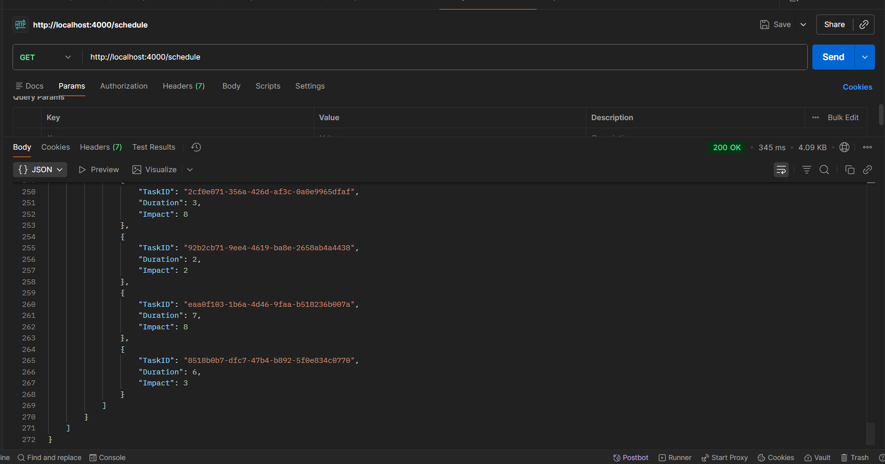
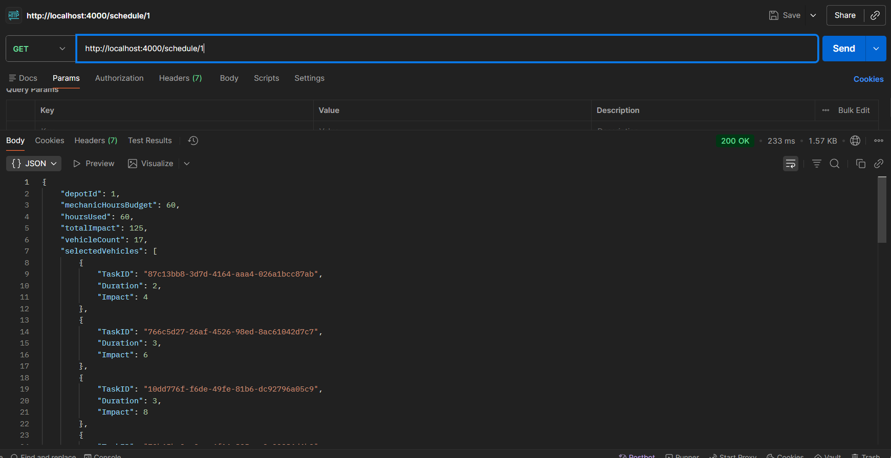
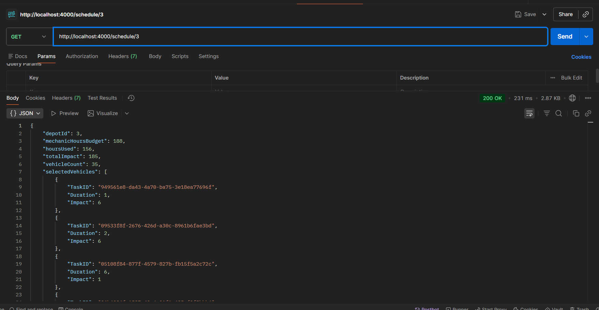
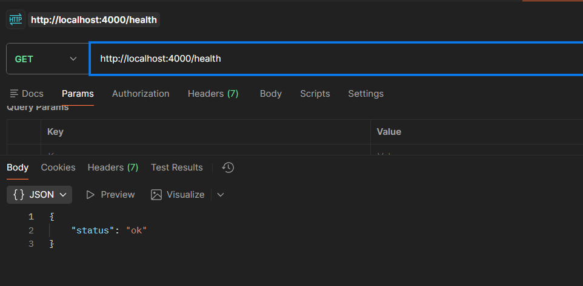
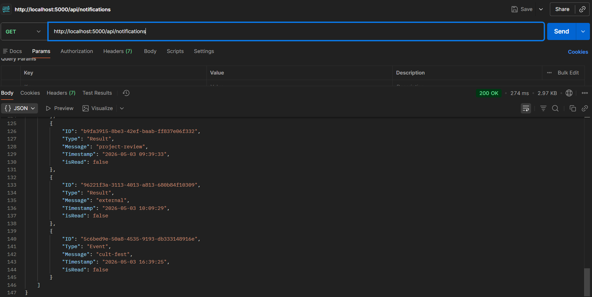
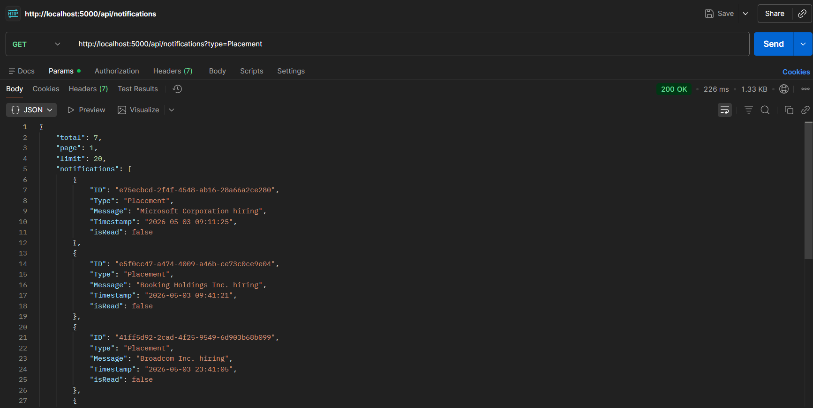
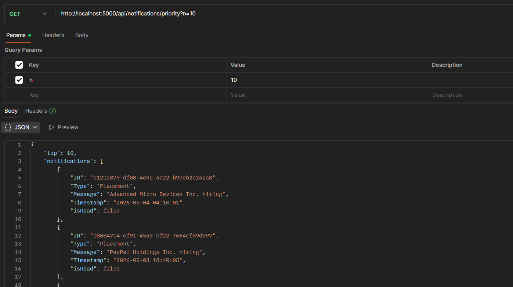
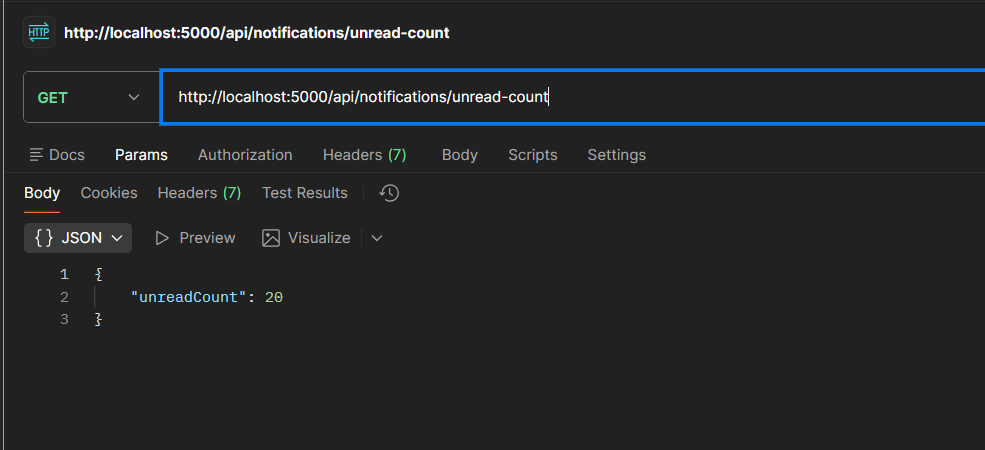
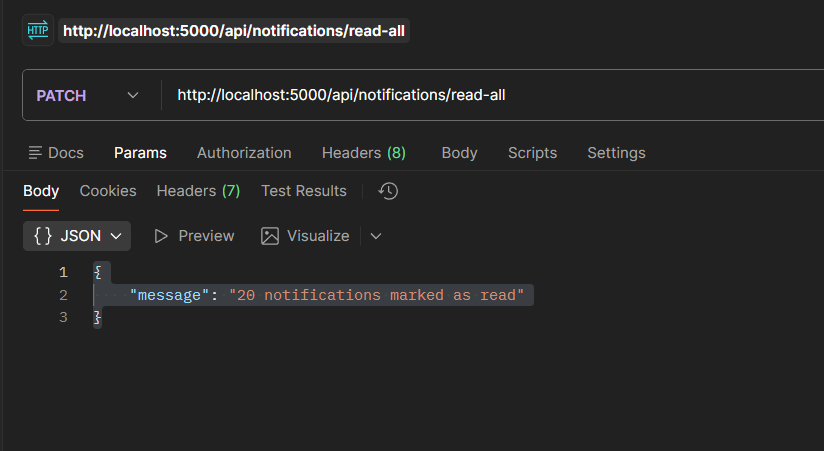

# Campus Hiring Evaluation — Backend
## (all api response are attached below)
## Vehicle Maintenance Scheduler

**Port:** 4000

0/1 Knapsack (DP) — O(n × W). Fetches depots and vehicles from the evaluation API, computes optimal schedule per depot.

**Endpoints:**

| Method | Path | Desc |
|--------|------|------|
| GET | `/health` | health check |
| GET | `/schedule` | all depots |
| GET | `/schedule/:depotId` | single depot |

**Screenshots:**

`GET /schedule`



`GET /schedule/1`



`GET /schedule/3`



`GET /health`



---

## Notification App

**Port:** 5000

In-memory cache (30s TTL), read-state tracking, filtering, pagination, priority inbox.

**Endpoints:**

| Method | Path | Desc |
|--------|------|------|
| GET | `/api/notifications` | list — `?type=&page=&limit=` |
| GET | `/api/notifications/:id` | single notification |
| GET | `/api/notifications/unread-count` | unread count |
| GET | `/api/notifications/priority?n=10` | priority inbox (Stage 6) |
| PATCH | `/api/notifications/:id/read` | mark read |
| PATCH | `/api/notifications/read-all` | mark all read |

**Screenshots:**

`GET /api/notifications`



`GET /api/notifications?type=Placement`



`GET /api/notifications/priority?n=10`



`GET /api/notifications/unread-count`



`PATCH /api/notifications/read-all`



---

## Design Doc

`notification_system_design.md` — stages 1 through 6.


Node.js / Express submission. All apps use the logging middleware from `logging_middleware/`.

## Structure

```
logging_middleware/             shared log module
vehicle_maintence_scheduler/    port 4000 — knapsack scheduling
notification_app_be/            port 5000 — notification REST API
notification_system_design.md   stages 1–6 design answers
```

## Run

```bash
# Vehicle scheduler
cd vehicle_maintence_scheduler
cp .env.example .env   # add AUTH_TOKEN
npm install && npm start

# Notification app (new terminal)
cd notification_app_be
cp .env.example .env   # add AUTH_TOKEN
npm install && npm start
```

Token expires every 15 min. Refresh via the auth endpoint.

---
